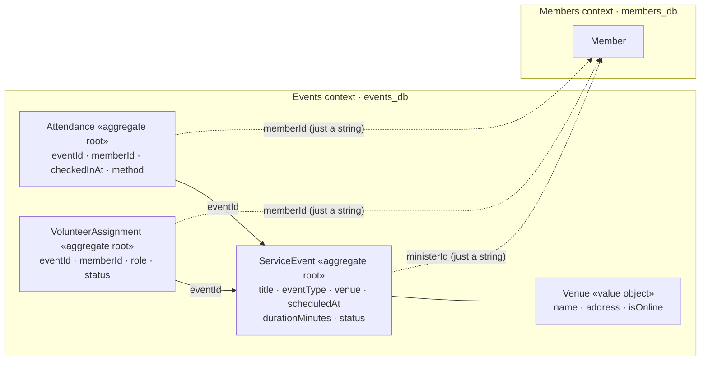

# Events Service — DDD Architecture Guide

`apps/events-service` is the second bounded context (CMS-18, roadmap stage 8). Its
layering is the same as members-service, which [`members-service-ddd.md`](members-service-ddd.md)
explains with diagrams, so this guide doesn't repeat it. It covers only what is **new**
here: three aggregates instead of one, a value object, rules that span aggregates, and
what it means to reference another context's data by id.

The design comes from [ADR-0004](adr/0004-events-context-aggregates.md). Read it first.

---

## 1. The model at a glance

- **Solid arrows** stay inside the context. They are real foreign keys in `events_db`.
- **Dotted arrows** cross into Members. They are plain strings with no foreign key, no
  import, and no copied name or email. Events can't even see `members_db`: it's a
  different Postgres server ([`k8s/events-postgres.yaml`](../k8s/events-postgres.yaml)).

| File                                                                                 | What it holds                                                                      |
| ------------------------------------------------------------------------------------ | ---------------------------------------------------------------------------------- |
| [`ServiceEvent.ts`](../apps/events-service/src/domain/ServiceEvent.ts)               | The `ServiceEvent` aggregate, the `Venue` value object, `EventType`, `EventStatus` |
| [`Attendance.ts`](../apps/events-service/src/domain/Attendance.ts)                   | The `Attendance` aggregate, `CheckInMethod`, the 2-hour check-in window            |
| [`VolunteerAssignment.ts`](../apps/events-service/src/domain/VolunteerAssignment.ts) | The `VolunteerAssignment` aggregate, `VolunteerRole`, `AssignmentStatus`           |
| [`events.ts`](../apps/events-service/src/domain/events.ts)                           | Domain event types (returned, not yet published)                                   |
| `*Repository.ts`                                                                     | One repository interface per aggregate root                                        |

---

## 2. Why three aggregates and not one

The obvious model is one `ServiceEvent` with an `attendees` list and a `volunteers`
list. ADR-0004 rejects it, and the reason is the most useful idea in this service:

> **An aggregate is a consistency boundary.** Everything inside it is loaded, checked,
> and saved together, in one transaction.

A Sunday service with 500 attendees would mean loading 500 rows to add the 501st. Two
people checking in at the same moment would both modify the same aggregate, and one
would have to fail and retry. Nothing about a check-in needs the _other_ 499 check-ins
to be consistent with it, except one rule, covered in §3.

So `Attendance` and `VolunteerAssignment` are aggregates of their own. Each one is
small, is saved on its own, and refers to its event **by id**.

---

## 3. Rules that span aggregates

If each aggregate only guards itself, who guards rules that involve several? There are
three such rules here, and each one is solved differently.

### 3.1 "Check-in needs an open event": pass the other aggregate in

[`Attendance.record()`](../apps/events-service/src/domain/Attendance.ts#L52) receives the
`ServiceEvent` itself and asks it
[`isOpenForCheckIn()`](../apps/events-service/src/domain/ServiceEvent.ts#L256). The event
answers a question about its own state; `Attendance` doesn't read `status` and
re-implement the rule. This is fine because both aggregates are in the **same** context.
(Passing a `Member` in would not be fine. That's another context.)

### 3.2 "One check-in per member per event": a uniqueness check plus a database constraint

No single `Attendance` can know whether another one exists. The use case checks first
([`RecordAttendanceUseCase.ts:29`](../apps/events-service/src/application/RecordAttendanceUseCase.ts#L29)),
which gives a clear `409`. That check alone has a race: two requests can both read
"not checked in yet" before either writes. The real guarantee is the unique index
([`schema.prisma:65`](../apps/events-service/prisma/schema.prisma#L65)). Only one INSERT
can win, and the loser's Prisma error `P2002` is translated into the same
`ConflictError` ([`uniqueViolation.ts`](../apps/events-service/src/infrastructure/uniqueViolation.ts#L8)).
An integration test fires two check-ins at once and expects exactly one `201` and one
`409` ([`eventRoutes.integration.test.ts:194`](../apps/events-service/src/api/eventRoutes.integration.test.ts#L194)).

### 3.3 "Cancelling declines all volunteers": several saves, no transaction

[`CancelEventUseCase`](../apps/events-service/src/application/CancelEventUseCase.ts)
changes one `ServiceEvent` and every `VolunteerAssignment` for it. Those are separate
saves, not one transaction. Two things can go wrong, and each has a fix:

- **A crash half-way.** Cancel is **idempotent**: cancelling an already-cancelled
  event skips the event and just declines the assignments again (declining twice is a
  no-op). So calling cancel again finishes the job, and returns `204` again.
- **A volunteer assigned at the same moment.** Cancel saves the event **first**, then
  reads the assignments to decline ("the sweep"). `AssignVolunteerUseCase` saves its
  assignment, then **re-reads the event**, and declines its own assignment if the event
  is now cancelled. Either the sweep sees the new assignment, or the new assignment
  sees the cancelled event. There is no ordering where both miss.

The first version of this use case saved the event _last_, and the code review found the
race: an assignment created after the sweep but before the event save stayed `pending`
on a cancelled event. At stage 9 the sweep can move into a handler for the
`EventCancelled` event. That's **eventual consistency**, the same idea at a bigger scale.

### 3.4 Two edits at once: optimistic locking

Two admins open the same event. One cancels it; the other, a second later, saves a new
title from the copy they loaded _before_ the cancel. A plain "save everything" would
write `status: scheduled` back, and the cancellation would silently disappear.

Each `ServiceEvent` row has a `version`. The repository updates only
`WHERE id = … AND version = <the version we loaded>`, and bumps it
([`PrismaServiceEventRepository.save`](../apps/events-service/src/infrastructure/PrismaServiceEventRepository.ts)).
If someone saved in between, no row matches, and the request fails with `409` ("reload
and try again") instead of overwriting their change. It's "optimistic" because nothing
is locked while the request runs; the check happens only at the moment of writing.
The integration test "optimistic locking" plays this exact story.

---

## 4. The Venue value object

A value object has no id and is defined only by its values. Two venues called "Main
Sanctuary" with no address _are_ the same venue
([`Venue.equals`](../apps/events-service/src/domain/ServiceEvent.ts#L27)). It's
immutable: an update replaces the whole venue. Its validation (name required) lives
inside it, so an invalid `Venue` can't exist anywhere in the code.

It needs no table, either. The repository flattens it into three columns, `venueName`,
`venueAddress` and `venueIsOnline` ([`schema.prisma:29`](../apps/events-service/prisma/schema.prisma#L29)),
and [`toRow()`](../apps/events-service/src/infrastructure/PrismaServiceEventRepository.ts#L27)
is the only code that knows that.

---

## 5. Time is a parameter

Three rules depend on the clock: "scheduled in the future", "check-in opens 2 hours
before", and the cancellation timestamp. Every domain method takes `now: Date = new Date()`
([`ServiceEvent.schedule`](../apps/events-service/src/domain/ServiceEvent.ts#L170)).
Production passes nothing and gets the real clock. Tests pass a fixed date, so
"exactly two hours before" is tested exactly, and no test breaks at midnight.

---

## 6. The API

Behind Traefik, every path is prefixed with `/api/events`, which the Ingress strips
(study-guide §7.4).

| Method and path               | Use case                  | Success                             | Errors                                           |
| ----------------------------- | ------------------------- | ----------------------------------- | ------------------------------------------------ |
| `POST /events`                | `ScheduleEventUseCase`    | `201 {id}`                          | 400 (schema or domain rule)                      |
| `GET /events?page&limit`      | repository `listUpcoming` | `200 {data, meta}`                  |                                                  |
| `GET /events/:id`             | repository `findById`     | `200`                               | 404                                              |
| `PUT /events/:id`             | `UpdateEventUseCase`      | `204`                               | 400, 404, 409 (changed by another request)       |
| `POST /events/:id/cancel`     | `CancelEventUseCase`      | `204` (also when already cancelled) | 400 (completed), 404, 409                        |
| `POST /events/:id/attendance` | `RecordAttendanceUseCase` | `201 {id}`                          | 400 (closed, not open yet), 404, 409 (duplicate) |
| `POST /events/:id/volunteers` | `AssignVolunteerUseCase`  | `201 {id}`                          | 400, 404, 409 (same role twice)                  |

Cancel is its own endpoint, not `PUT {status: "cancelled"}`, because it's a state
transition with its own rule, its own required reason, and its own domain event.

**Two kinds of 400.** The JSON schema rejects malformed input before the handler runs
(missing `venue`, `eventType: "concert"`, a `memberId` that isn't a UUID). The domain
rejects input that is well-formed but breaks a rule (an event in the past). Shape checks
belong at the edge; business rules belong in the domain, the only place that can
enforce them for every caller.

---

## 7. Where the ticket and the ADR disagreed

CMS-18 was written before ADR-0004 was accepted. Where they differ, the code follows
the ADR:

| Ticket said                                                 | ADR-0004 says (and the code does)                                                       |
| ----------------------------------------------------------- | --------------------------------------------------------------------------------------- |
| `EventType`: Sunday Service, Prayer Meeting, Youth, Special | `"service" \| "event"`. A prayer meeting is an `event` with a title                     |
| `Location` value object                                     | `Venue` (name, address, isOnline)                                                       |
| separate `date` and `time`                                  | one `scheduledAt` plus `durationMinutes`                                                |
| "`EventCreated` published to message bus"                   | Stage 9 (CMS-22). The aggregates return their domain events; nothing publishes them yet |

---

## 8. Known gaps (deliberate)

- **Domain events aren't published.** They're returned and dropped. CMS-22 adds NATS,
  and then the shared contract for `AttendanceRecorded` moves to `packages/` (`@cms/events`).
- **`memberId` isn't checked against Members.** Events only checks that it's a UUID.
  Checking that the member exists would mean a synchronous call to members-service on
  every check-in, which couples their availability: if Members is down, nobody can check
  in. Stage 9 offers a better option, a local list of known members kept up to date
  from `MemberRegistered`/`MemberArchived` events.
- **No auth.** `createdById` and `assignedById` come in the request body until the
  Identity context exists. Then they come from the token.
- **Not reachable through the API yet:** the `ongoing`/`completed` transitions,
  confirming or declining a volunteer, QR check-in, and listing an event's attendance.
  The types are modelled; the endpoints come with the ticket that needs them.
- **Check-in never closes.** ADR-0004 only says when check-in _opens_. Closing it needs
  the `completed` transition, which nothing triggers yet, so a past event still accepts
  check-ins. It lands with the start/complete ticket.
- **`GET /events` only lists events that haven't started.** That's what "upcoming"
  means in the ticket. An event in progress is still reachable by id.
- **A `500` shows Prisma's error text** (including the database hostname). Fastify's
  default error handler does this in both services; hiding 5xx details belongs in a
  shared fix, not in one service.

---

## Quick reference — what's new compared with Members

| Idea                                                                      | Where |
| ------------------------------------------------------------------------- | ----- |
| Several aggregates, each its own consistency boundary                     | §2    |
| A rule checked by asking another aggregate (same context)                 | §3.1  |
| Uniqueness across aggregates: use case check + unique index + P2002 → 409 | §3.2  |
| A use case that saves several aggregates in a retry-safe order            | §3.3  |
| Optimistic locking with a `version` column                                | §3.4  |
| A value object, flattened into columns                                    | §4    |
| An injectable clock for time-based rules                                  | §5    |
| Referencing another context: id only, no FK, no copy                      | §1    |
