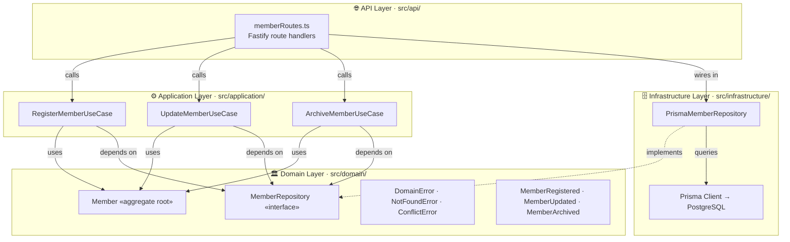
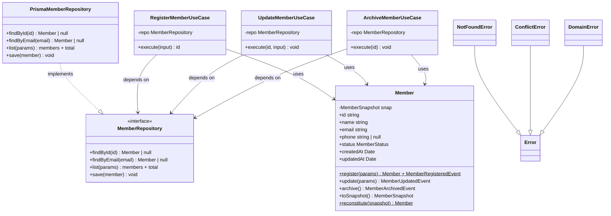
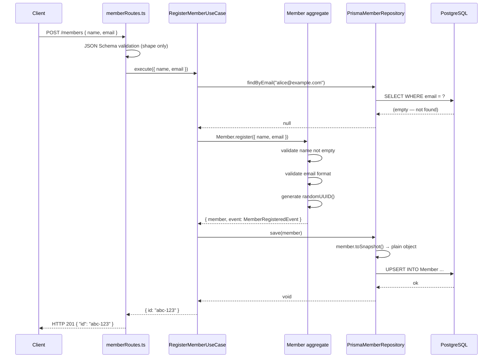
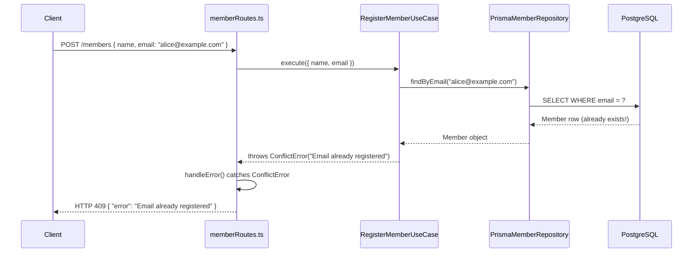
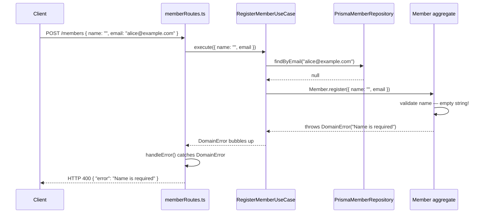

# Members Service — DDD Architecture Guide

This document explains the architecture of `apps/members-service` through diagrams.
It maps directly to the code written in CMS-6 and is intended as a learning reference.

---

## 1. Layer Architecture

DDD organises code into four layers. The single most important rule:
**dependencies only point inward — inner layers never import from outer layers.**



### What each layer does and what it knows about

| Layer              | Folder                | Responsibility                      | Allowed to import from       |
| ------------------ | --------------------- | ----------------------------------- | ---------------------------- |
| **Domain**         | `src/domain/`         | Business rules and invariants       | Nothing — zero external deps |
| **Application**    | `src/application/`    | Orchestrates one use case per class | Domain only                  |
| **Infrastructure** | `src/infrastructure/` | Talks to the database               | Domain interfaces + Prisma   |
| **API**            | `src/api/`            | Translates HTTP ↔ use cases         | Application + Infrastructure |

The dashed arrow (Infrastructure → Domain interface) is the key insight of this
architecture, called **Dependency Inversion**:

> The domain _defines_ what storage it needs (`MemberRepository` interface).
> Infrastructure _fulfils_ that promise (`PrismaMemberRepository`).
> The domain never imports Prisma — it doesn't know Prisma exists.

---

## 2. Domain Model

This diagram shows all the types inside `src/domain/` and how they relate.



### Key concepts explained

**Aggregate Root — `Member`**
The central object that _owns and enforces_ all invariants for a member.
Its constructor is `private`, so it can only be created through `Member.register()`,
which validates inputs first. You can never accidentally create a `Member` in an
invalid state — the type system prevents it.

**Repository Interface — `MemberRepository`**
A contract the domain defines for what storage capabilities it needs. Defined
in the domain layer, implemented in infrastructure. The use cases hold a reference
to this _interface_, not to `PrismaMemberRepository` directly. This means you
could swap Postgres for MongoDB and the use cases would not change at all.

**Domain Events — `MemberRegistered`, `MemberUpdated`, `MemberArchived`**
Plain typed objects returned whenever something meaningful happens inside the
aggregate. Currently collected but not published (Phase 1 is synchronous HTTP).
In Phase 2 they will be sent to NATS so other services — like `events-service`
— can react without the Members service needing to call them directly.

**Error types**
| Type | Meaning | HTTP status |
|---|---|---|
| `DomainError` | An invariant was broken — invalid name, bad email format | 400 |
| `NotFoundError` | The requested aggregate doesn't exist | 404 |
| `ConflictError` | Application-level constraint failed — duplicate email | 409 |

---

## 3. Request Flow — Sequence Diagrams

### Happy path: `POST /members` — new member registered



### Error path: duplicate email → 409 Conflict



### Error path: invalid input → 400 Bad Request



### What to notice across all three flows

- **The domain is always in the middle.** It never receives an HTTP request and
  never talks to a database. It just enforces rules on plain TypeScript objects.
- **The use case decides the order of operations** — check uniqueness, then create,
  then save. Neither the API nor the domain orchestrates this.
- **Errors travel outward unchanged.** `DomainError` bubbles from the aggregate →
  through the use case → to `handleError()` in the route → becomes HTTP 400.
  Each layer lets it pass; only the outermost layer translates it.
- **The database is always at the edge.** It never directly influences the domain.

---

## 4. Why the domain has no dependencies

The payoff of all this separation is visible in the test output:

```
src/domain/Member.test.ts      ✓  13 tests  3ms
src/application/...test.ts     ✓   3 tests  4ms
```

The domain tests run in **3 milliseconds** with no database, no HTTP server,
and no Fastify. They're just TypeScript classes exercising TypeScript logic.

This is because `src/domain/` imports nothing outside the standard library:

```
Member.ts          imports → crypto (Node built-in), ./errors.js, ./events.js
MemberRepository.ts imports → ./Member.js (its own layer)
errors.ts          imports → nothing
events.ts          imports → nothing
```

If you ever wanted to move from Fastify to Express, or from Postgres to MongoDB,
or expose this via a CLI instead of HTTP — the entire `src/domain/` folder would
be completely unchanged.

---

## Quick reference — dependency rules

```
API          may import → Application, Infrastructure (for wiring only)
Application  may import → Domain
Infrastructure may import → Domain interfaces + Prisma
Domain       may import → nothing outside src/domain/
```

Break any of these rules and the architecture starts to collapse inward.
The TypeScript compiler won't stop you — discipline does.
